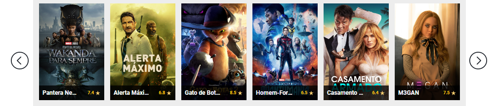
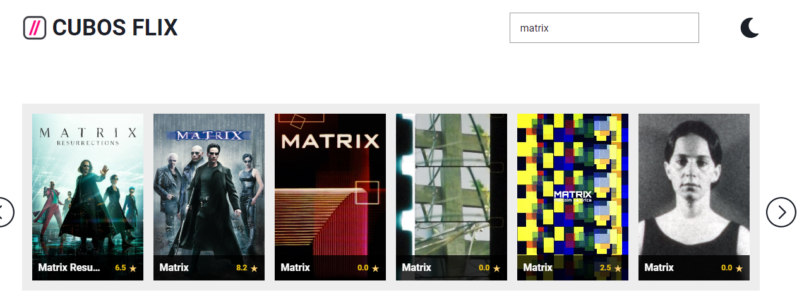

# Utilização
## Página inicial
Ao acessar a página inicial, você encontrará um carrossel de imagens de filmes. Cada imagem representa um filme. Para ver a sinopse de um filme, clique na imagem correspondente.

## Sinopse do Filme
Ao clicar em uma imagem do carrossel, você será direcionado para a página da sinopse do filme correspondente. Nessa página, você poderá encontrar informações sobre o filme, como título, avaliação média, gênero e uma breve descrição da trama.

 
## Fechar o Modal
Para fechar o modal, basta clicar no botão "X" presente na tela. Isso fará com que o modal desapareça da tela.

## Pesquisar filmes
Para fazer novas pesquisas, basta clicar no input "Pesquisar". Digite o título do filme que deseja encontrar e aperte Enter. Os resultados serão exibidos na tela.
 
## Filme do Dia
O site possui uma seção chamada "Filme do Dia", onde um filme é destacado como destaque do dia. Essa seção pode ser encontrada na página inicial, abaixo do carrossel de filmes.
O filme do dia é escolhido aleatoriamente e é destacado na seção correspondente na página inicial. Ao clicar na imagem do filme do dia, o usuário é direcionado para o trailer do filme.

